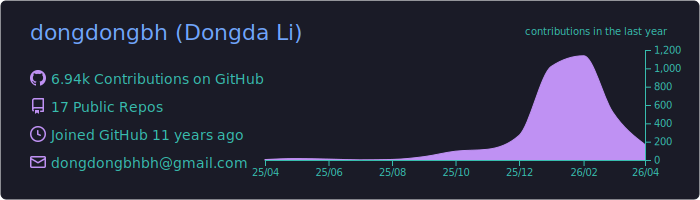
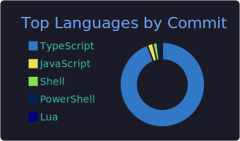

# Hi there, I'm Dongda Li! 👋

 

<h3 align="center"><i>Make it if you don't get it</i></h3>

### 👨‍💻   OSS Enthusiast
My background bridges Computer Science and Electrical Engineering.

- 🔭 **Research:** I specialize in Machine Learning, Neural Combinatorial Optimization, Autonomous System.
- 🐧 **System:** I run **Arch Linux** (btw) and live in the terminal.
- ⚡ **Editor:** Neovim is my weapon of choice.
- 🌱 **About:** Lifelong learner, always curious.
- 🛠 **Open Source:** I am the creator and maintainer of **[Mindwtr](https://github.com/dongdongbh/Mindwtr)**.

---

### 🚀 Languages & Tools

  
  
  
  
  
  
  
  
  
  

---

🏆 Notable Projects:

   
  <table width="100%">
    <tr>
      <th>Project</th>
      <th>Description</th>
    </tr>
    <tr>
      <td>
        
        <a href="https://github.com/dongdongbh/Mindwtr">Mindwtr</a>
      </td>
      <td>A complete Getting Things Done (GTD) productivity system for desktop and mobile. Mind Like Water.</td>
    </tr>
  </table>

---

### 📊 GitHub Stats

  
  
  <!--   -->

---

### 📫 Connect with Me

  
<b>Show some ❤️ by starring some of the repositories!</b>

